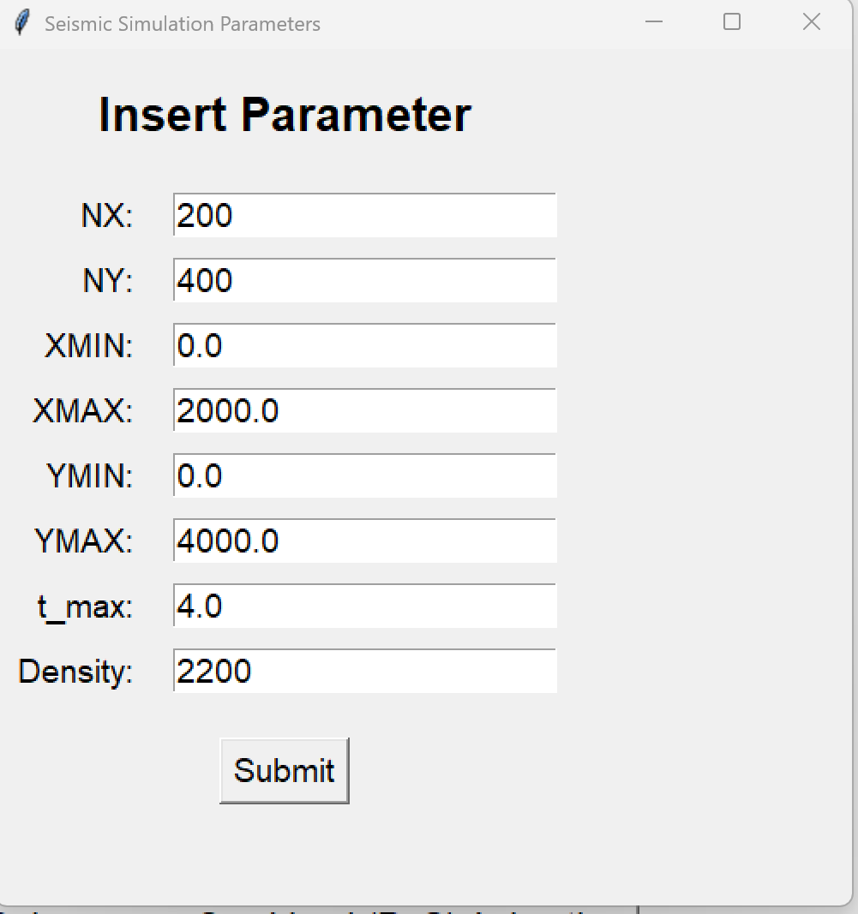
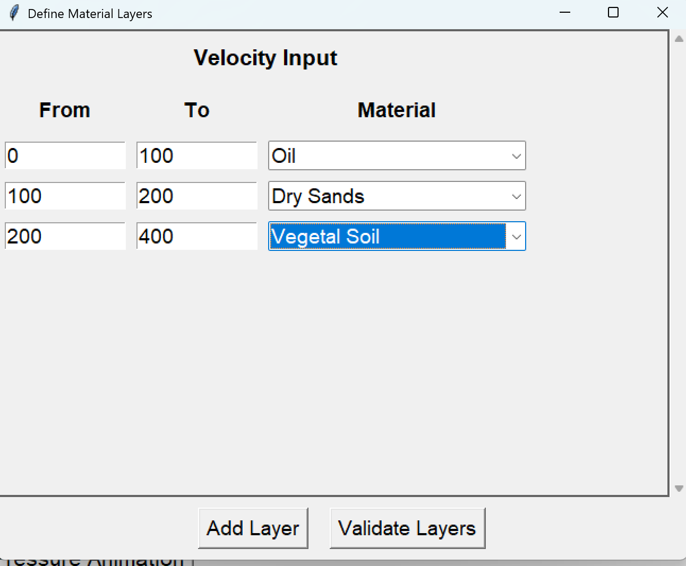
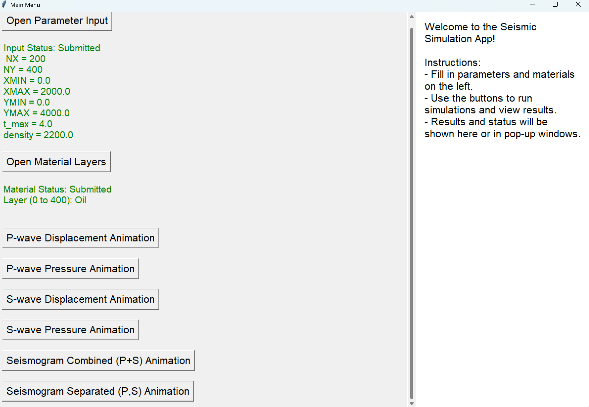
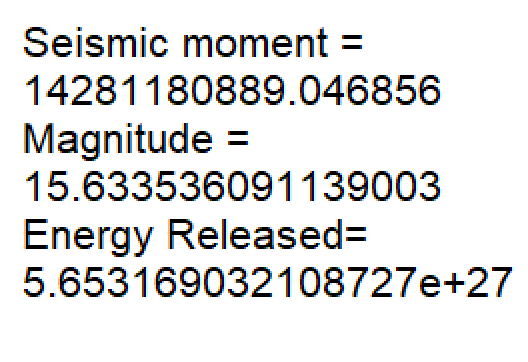
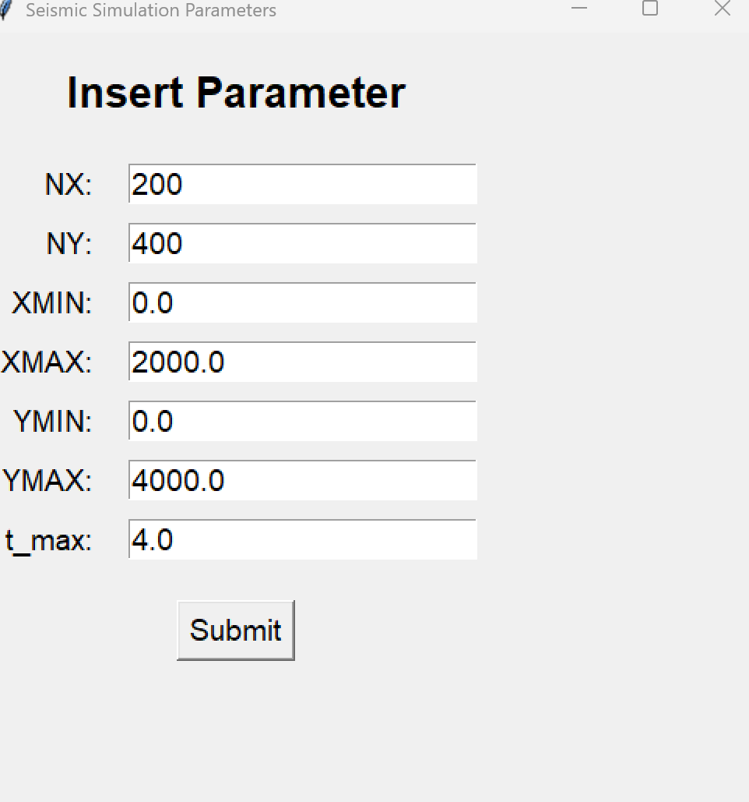
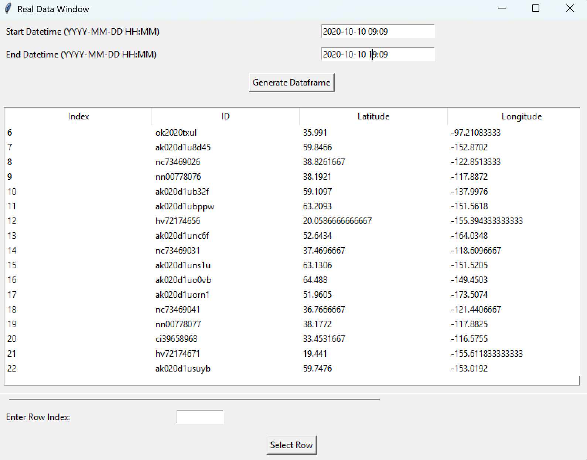
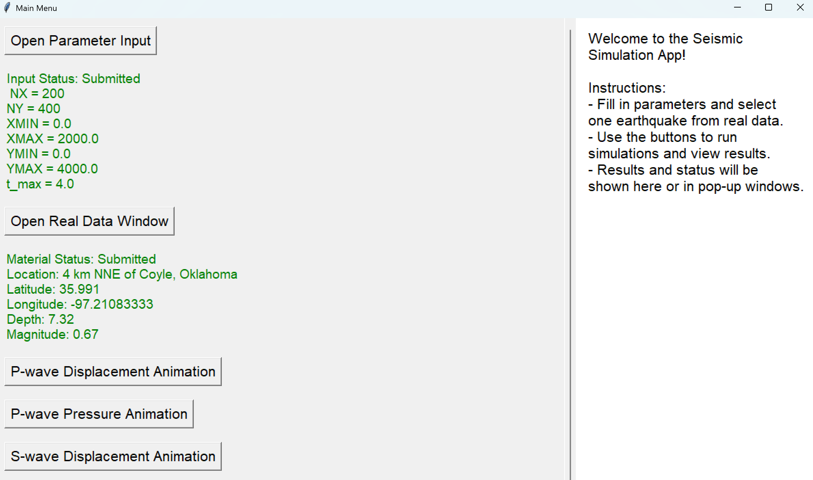

# Computational-Physics-Final-Project (Earthquake Simulator)

**Members:**
- Ella Raputri (2702298154) 
- Ellis Raputri (2702298116)

**Class:** L4AC

<br>

## Project Description
This project is a simple earthquake simulator app that shows the properties of P (Primary) wave and S (Secondary) wave. These properties includes the displacement and pressure in P wave, also displacement and shear stress in S wave. This project also includes a synthetic seismogram that is created based on the input calculations. Lastly, this project also incorporates real data by utilizing the libcomcat library that compiles all earthquakes history in the world.

<br>

## Setup Process

### Downloading the zip file

- Download the zip file from the source.

- Change directory to the respective directory.
    ```text
    cd Computational-Physics-Final-Project
    ```

- Installing all dependencies
    ```text
    pip install -r requirements.txt
    ```

### Cloning from GitHub

- Clone the repository and change directory to the respective repository.
    ```text
    git clone https://github.com/ellisraputri/Computational-Physics-Final-Project
    cd Computational-Physics-Final-Project
    ```

- Installing all dependencies
    ```text
    pip install -r requirements.txt
    ```

<br>


## Running the Application

<details>
<summary> <b>GUI (Simulator with synthetic input)</b> </summary>

- Change directory to the GUI folder, and run the python file. Note: main.py is the simulator based on synthetic input, while main2.py is the simulator incorporating real data.
    ```text
    cd GUI
    python main.py    
    ```
<br>

- Fill in the parameter input window. 

    

    Parameter Note:
    - NX = Number of grid points in the x-direction (horizontal)
    - NY = Number of grid points in the y-direction (vertical)
    - XMIN = Minimum value of the x-axis (in meters)
    - XMAX = Maximum value of the x-axis (in meters)
    - YMIN = Minimum value of the y-axis (in meters)
    - YMAX = Maximum value of the y-axis (in meters)
    - t_max = Maximum simulation time (in seconds)
    - Density = The density of the layer (in kg/m<sup>3</sup>) <br><br>

- Fill in the material layers window. You can add as much layer as possible up to NY value. Make sure to include solid materials as layers since S wave cannot move through liquids or gases.

    <br><br>

- After validating the parameter inputs and layers, you can click the buttons below to view the respective animations. 

    <br><br>

- To view the seismic moment, magnitude, and energy released, you need to run the S-wave displacement animation first. 

    

</details>

<br>

<details>
<summary> <b>GUI (Simulator with real data)</b> </summary>

- Change directory to the GUI folder, and run the python file. Note: main.py is the simulator based on synthetic input, while main2.py is the simulator incorporating real data.
    ```text
    cd GUI
    python main2.py    
    ```
<br>

- Fill in the parameter input window. 

    

    Parameter Note:
    - NX = Number of grid points in the x-direction (horizontal)
    - NY = Number of grid points in the y-direction (vertical)
    - XMIN = Minimum value of the x-axis (in meters)
    - XMAX = Maximum value of the x-axis (in meters)
    - YMIN = Minimum value of the y-axis (in meters)
    - YMAX = Maximum value of the y-axis (in meters)
    - t_max = Maximum simulation time (in seconds) <br><br>

- Fill in the dates you want to get the real data earthquake. Then, click on the generate dataframe. After that, you can enter your desired data index, then submit it.

    <br><br>

- After validating the parameter inputs and real datas, you can click the buttons below to view the respective animations. 

    <br><br>

- To view the seismic moment, magnitude, and energy released, you need to run the S-wave displacement animation first. 

    

</details>

<br>

<details>

<summary><b>Jupyter Notebooks</b></summary>

- Contains a more specific explanation of each code (mainly about the mathematical background).

- Below are the brief explanations of each Jupyter Notebook contents:

    - P_wave_disp.ipynb: P-wave displacement animation

    - P_wave_pressure.ipynb: P-wave pressure animation

    - real_data.ipynb: how we incorporate the real data
    
    - S_wave.ipynb: S-wave displacement and shear stress animation

    - seismogram.ipynb: overall seismogram animation (combined P-wave and S-wave, or separated)

- You can just run this Jupyter Notebook to view the results. However, some of the animations may not work, but they will show up in the folder. So, you can just view the animations from the folder.


</details>


## Demo Video

To access the demo video, please refer to this [link](https://drive.google.com/file/d/18DiBJ7Imyb80yAAzuTf9Xjux5Lgltusj/view)